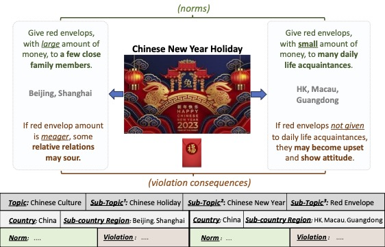

# LLM-MassiveMulticultureNormsKnowledge-NCLB

**No Culture Left Behind: Massively Multi-Cultural LM Knowledge Acquisition Benchmarking on 1000+ Sub-Country Regions and 2000+ Ethnolinguistic Groups**



## Overview: 
In this project, we aim to address two important research questions:
i.) What are the underlying fine-grained rules/norms in different parts of society around the world; and
ii.) Do current SOTA LLM have a sufficient grasp of these knowledge?

To achieve these objectives, our specific approach & implementation is to:
i.) Construct a benchmark of massively multicultural norms; and
ii.) Evaluate different SOTA LLM on their pretrained knowledge & zero-shot reasoning performance in this domain

[[paper]](https://arxiv.org/pdf/2402.09369.pdf) [[data]](https://drive.google.com/drive/folders/1LN8yrKseTJIAb3FdIr0-Jy3eZNZUI7vo?usp=sharing) [[transition]](https://drive.google.com/drive/folders/1Z_WAiAduuXVvCx6xPC6mfkjmzAnCeCfw?usp=sharing)

## Preliminary Setup ##

Install llama from inside `lib/llama`, and install vicuna from inside `lib/FastChat`. I've tweaked the code inside this directory path to return logprob etc.


## To Construct our Massively Multicultural Norms KB

We start from a list of countries/ethnolinguisticreligiousgroups/topics in `data/culture_taxonomy/`.

1. Run the scraping script based on this
```
|- src/culture_crawling.py
```

2. Perform preprocessing
```
|- src/preproc_data.py
|- src/construct_mm_benchmark.py
|- src/utils.py
```

To compute initial stats about the dataset and assess quality do:
```
|- scripts/eval_cultural_profile_extraction.py  # check on culture profile extraction quality
|- scripts/eval_quality_check_NormFrames.py  # skipped for now
|- scripts/qual_check_neg_data_gen.py # quality check positive norms and negative norms
|- scripts/qual_check_pos_data_gen.py
|- scripts/stats.py  # count the stats of the norms within our datasET
|- utils/print_CulturalNormKnowledge_stats.py  # this one counts the stats for comparing across benchmark resources
```

## Data

```
|- data/
 |- culture_scraped_info/
  |- culture_info_beta_Oct6.pkl  # From initial scraped Wiki sents alone
                                 # (194 countries, 36k wikipages, 650k culturally relevant sents)
  |- 
```

## Benchmark Foundation Models
Llama:
```
# Run -chat ckpt version
torchrun --nproc_per_node 1 eval/benchmark_llama.py --ckpt_dir ckpts/llama/llama-2-7b-chat/ \
    --tokenizer_path tokenizer.model --max_seq_len 512 --max_batch_size 4

# For -hf ckpt version
python eval/benchmark_llama.py #(if it's hf ckpt)
```

Vicuna:
```
python eval/benchmark_Vicuna.py --model lmsys/vicuna-7b-v1.3
python eval/benchmark_Vicuna.py --model lmsys/vicuna-13b-v1.3 --num-gpus 2
```

## License
Our dataset is licensed under a Creative Commons Attribution-NonCommercial-ShareAlike 4.0 International License.
